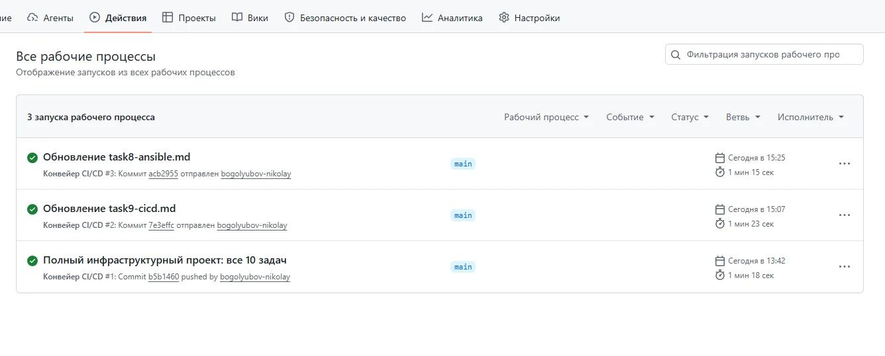

# Инфраструктурный проект

**Автор:** Боголюбов Николай Сергеевич  
**Контакты:** [Telegram](https://t.me/bogolyubov_n) | [Email](mailto:bnikolai82@mail.ru) | +7 (922) 254-34-95  

---

### О проекте
Демонстрация навыков системного администратора и инженера: Linux, Bash, systemd, iptables, Ansible, CI/CD.

Все задания выполнены на реальном VPS (Ubuntu 24.04, RuVDS) и сохранены в репозитории.

### 📸 Демонстрация работы


---

### Структура
- `ansible/` — плейбуки, роль webserver, инвентарь
- `scripts/` — bash‑скрипты (backup, log‑parser, monitor, check‑updates)
- `nginx-configs/` — конфигурации Nginx
- `iptables/` — сохранённые правила iptables
- `docs/` — документация и доказательства по каждому заданию
- `.github/workflows/` — CI/CD пайплайн

---

### Как развернуть с нуля
```bash
git clone https://github.com/bogolyubov-nikolay/infra-project.git
cd infra-project
ansible-playbook -i ansible/inventory.ini ansible/deploy_full.yml
