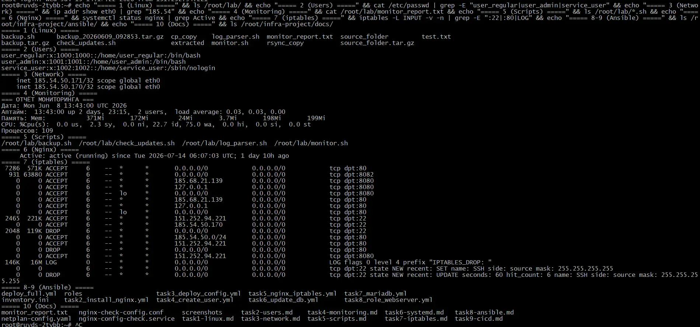
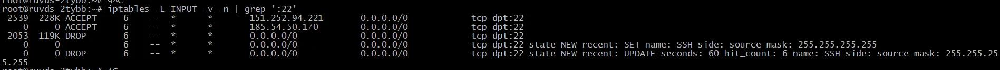

# Инфраструктурный проект

**Автор:** Боголюбов Николай Сергеевич  
**Контакты:** [Telegram](https://t.me/bogolyubov_n) | [Email](mailto:bnikolai82@mail.ru) | +7 (922) 254-34-95  

---

### О проекте
Демонстрация навыков системного администратора и инженера: Linux, Bash, systemd, iptables, Ansible, CI/CD.

Все задания выполнены на реальном VPS (Ubuntu 24.04, RuVDS) и сохранены в репозитории.

| Главная страница Nginx | Успешный CI/CD |
|:---:|:---:|
|  |  |

| Проверка всех заданий | Правила iptables |
|:---:|:---:|
|  |  |
---

### Выполненные задания
| № | Задание | Ключевые файлы |
|---|---------|----------------|
| 1 | Базовые команды Linux | [`docs/task1-linux.md`](docs/task1-linux.md) |
| 2 | Управление пользователями | [`docs/task2-users.md`](docs/task2-users.md) |
| 3 | Конфигурация сети | [`docs/task3-network.md`](docs/task3-network.md) |
| 4 | Мониторинг и логирование | [`docs/task4-monitoring.md`](docs/task4-monitoring.md) |
| 5 | Bash‑скрипты | [`docs/task5-scripts.md`](docs/task5-scripts.md) |
| 6 | systemd | [`docs/task6-systemd.md`](docs/task6-systemd.md) |
| 7 | iptables | [`docs/task7-iptables.md`](docs/task7-iptables.md) |
| 8 | Ansible (роли) | [`docs/task8-ansible.md`](docs/task8-ansible.md) |
| 9 | CI/CD | [`docs/task9-cicd.md`](docs/task9-cicd.md) |
| 10 | Документация | [`docs/task1-linux.md`](docs/task1-linux.md) … [`docs/task9-cicd.md`](docs/task9-cicd.md) |

### Структура
- `ansible/` — плейбуки, роль webserver, инвентарь
- `scripts/` — bash‑скрипты (backup, log‑parser, monitor, check‑updates)
- `nginx-configs/` — конфигурации Nginx
- `iptables/` — сохранённые правила iptables
- `docs/` — документация и доказательства по каждому заданию
- `.github/workflows/` — CI/CD пайплайн

---

### Как развернуть с нуля
```bash
git clone https://github.com/bogolyubov-nikolay/infra-project.git
cd infra-project
ansible-playbook -i ansible/inventory.ini ansible/deploy_full.yml
